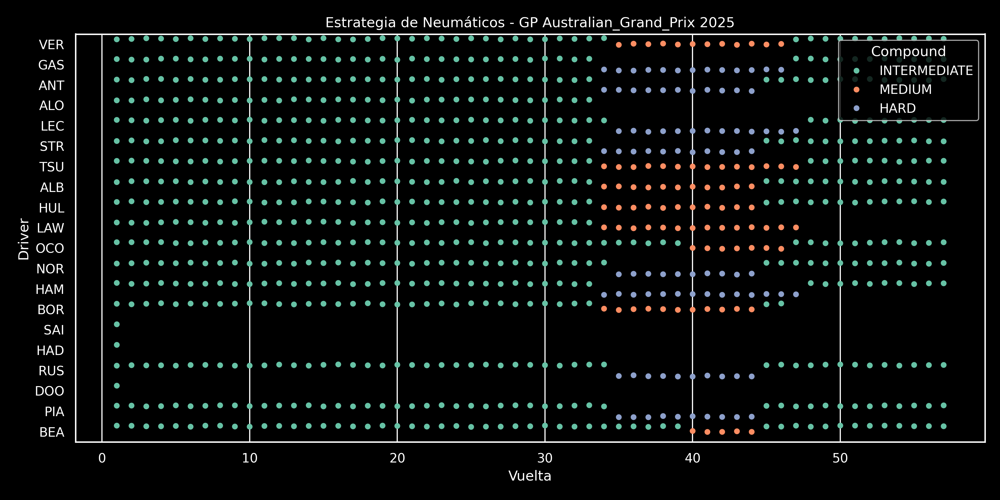

# F1 Temporada 2025 – Análisis de Datos

F1 Temporada 2025 Data Análisis es un proyecto de análisis de datos
de Fórmula 1 utilizando la librería FastF1 para obtener datos oficiales
de cada Gran Premio de la temporada 2025. El objetivo es generar
visualizaciones interactivas y gráficas de ritmo de carrera,
estrategias de neumáticos, paradas en boxes, degradación del
rendimiento y otros aspectos clave de las carreras. El proyecto
emplea Python junto con bibliotecas como Matplotlib, Seaborn y
Plotly para producir análisis visuales y reportes.

# Clasificación del Gran Premio de Australia 2025

| Posición | Piloto                     | Equipo                        | Tiempo/Diferencia | Notas                     |
|----------|----------------------------|-------------------------------|-------------------|---------------------------|
| 1        | Lando Norris              | McLaren-Mercedes              | 1:42:06.304       | Pole, Vuelta rápida       |
| 2        | Max Verstappen            | Red Bull-Honda RBPT           | +0.895            |                           |
| 3        | George Russell            | Mercedes                      | +8.481            |                           |
| 4        | Andrea Kimi Antonelli     | Mercedes                      | +10.135           |                           |
| 5        | Alexander Albon           | Williams-Mercedes             | +12.773           |                           |
| 6        | Lance Stroll              | Aston Martin-Mercedes         | +17.413           |                           |
| 7        | Nico Hülkenberg           | Kick Sauber-Ferrari           | +18.423           |                           |
| 8        | Charles Leclerc           | Ferrari                       | +19.826           |                           |
| 9        | Oscar Piastri             | McLaren-Mercedes              | +20.448           |                           |
| 10       | Lewis Hamilton            | Ferrari                       | +22.473           |                           |
| 11       | Pierre Gasly              | Alpine-Renault                | +26.502           |                           |
| 12       | Yuki Tsunoda              | Racing Bulls-Honda RBPT       | +29.884           |                           |
| 13       | Esteban Ocon              | Haas-Ferrari                  | +33.161           |                           |
| 14       | Oliver Bearman            | Haas-Ferrari                  | +40.351           |                           |
| DNF      | Liam Lawson               | Red Bull-Honda RBPT           | -                 | Accidente (Vuelta 46)     |
| DNF      | Gabriel Bortoleto         | Kick Sauber-Ferrari           | -                 | Accidente (Vuelta 45)     |
| DNF      | Fernando Alonso           | Aston Martin-Mercedes         | -                 | Accidente (Vuelta 32)     |
| DNF      | Carlos Sainz Jr.          | Williams-Mercedes             | -                 | Accidente (Vuelta 1)      |
| DNF      | Jack Doohan               | Alpine-Renault                | -                 | Accidente (Vuelta 1)      |
| DNF      | Isack Hadjar              | Racing Bulls-Honda RBPT       | -                 | Accidente (V. Formación)  |

## Notas
- **Fecha**: 16 de marzo de 2025
- **Circuito**: Albert Park, Melbourne
- **Vueltas**: 57 (de 58 previstas, reducidas por accidente en la vuelta de formación)
- **Condiciones**: Lluvia intermitente, tres períodos de coche de seguridad
- **Pole Position**: Lando Norris (1:15.096)
- **Vuelta Rápida**: Lando Norris (1:22.167, vuelta 43)
- **Incidentes**: La penalización inicial a Andrea Kimi Antonelli fue revisada, manteniendo su 4° puesto.

# Resumen del Gran Premio de Australia 2025
El Gran Premio de Australia 2025, celebrado el 16 de marzo en Albert Park, Melbourne,
fue una carrera intensa marcada por la lluvia intermitente y múltiples incidentes.
Lando Norris (McLaren) dominó desde la pole position, liderando de principio a fin para
lograr su tercera victoria consecutiva en Australia, con un tiempo de 1:42:06.304 y
la vuelta rápida (1:22.167). Max Verstappen (Red Bull) quedó a solo 0.895 segundos en segundo lugar,
mientras que George Russell (Mercedes) completó el podio.La carrera, reducida a 57 vueltas por
un accidente de Isack Hadjar en la vuelta de formación, tuvo tres períodos de coche de seguridad
debido a choques, incluyendo los abandonos de Carlos Sainz Jr. y Jack Doohan en la primera vuelta,
Fernando Alonso en la vuelta 32, y Liam Lawson y Gabriel Bortoleto en las vueltas 46 y 45, respectivamente.
Andrea Kimi Antonelli (Mercedes) brilló con un cuarto puesto tras la revisión de una penalización.
Las condiciones climáticas y los incidentes mantuvieron la emoción hasta el final, con McLaren
consolidando su liderazgo en el campeonato de constructores.

## Ritmo de Carrera — Australian Grand Prix 2025

## Estrategía de Neumáticos

## Evolución de Posiciones

## Paradas en Boxes

## Degradación de ritmo

# Clasificación del Gran Premio de China 2025

| Posición | Piloto                     | Equipo                        | Tiempo/Diferencia | Puntos | Notas                     |
|----------|----------------------------|-------------------------------|-------------------|--------|---------------------------|
| 1        | Oscar Piastri             | McLaren-Mercedes              | 1:30:55.026       | 25     | Pole                      |
| 2        | Lando Norris              | McLaren-Mercedes              | +9.748            | 18     | Vuelta rápida             |
| 3        | George Russell            | Mercedes                      | +11.097           | 15     |                           |
| 4        | Max Verstappen            | Red Bull-Honda RBPT           | +16.656           | 12     |                           |
| 5        | Esteban Ocon              | Haas-Ferrari                  | +49.969           | 10     |                           |
| 6        | Andrea Kimi Antonelli     | Mercedes                      | +53.748           | 8      |                           |
| 7        | Alexander Albon           | Williams-Mercedes             | +56.321           | 6      |                           |
| 8        | Oliver Bearman            | Haas-Ferrari                  | +1:01.303         | 4      |                           |
| 9        | Lance Stroll              | Aston Martin-Mercedes         | +1:10.204         | 2      |                           |
| 10       | Carlos Sainz              | Williams-Mercedes             | +1:16.387         | 1      |                           |
| 11       | Isack Hadjar              | Racing Bulls-Honda RBPT       | +1:18.875         | 0      |                           |
| 12       | Liam Lawson               | Red Bull-Honda RBPT           | +1:21.147         | 0      |                           |
| 13       | Jack Doohan               | Alpine-Renault                | +1:28.401         | 0      | Penalización 10s          |
| 14       | Gabriel Bortoleto         | Kick Sauber-Ferrari           | +1 vuelta         | 0      |                           |
| 15       | Nico Hülkenberg           | Kick Sauber-Ferrari           | +1 vuelta         | 0      |                           |
| 16       | Yuki Tsunoda              | Racing Bulls-Honda RBPT       | +1 vuelta         | 0      |                           |
| DNF      | Fernando Alonso           | Aston Martin-Mercedes         | -                 | 0      | Abandono (Vuelta 4)       |
| DSQ      | Charles Leclerc           | Ferrari                       | -                 | 0      | Coche con peso insuficiente |
| DSQ      | Lewis Hamilton            | Ferrari                       | -                 | 0      | Desgaste excesivo del skid |
| DSQ      | Pierre Gasly              | Alpine-Renault                | -                 | 0      | Coche con peso insuficiente |

## Notas
- **Fecha**: 23 de marzo de 2025
- **Circuito**: Shanghai International Circuit, Shanghai
- **Vueltas**: 56
- **Condiciones**: Nublado
- **Pole Position**: Oscar Piastri (1:30.641)
- **Vuelta Rápida**: Lando Norris (1:35.454, vuelta 53)
- **Incidentes**:
  - Descalificaciones de Charles Leclerc y Pierre Gasly por coches con peso insuficiente.
  - Descalificación de Lewis Hamilton por desgaste excesivo del skid.
  - Jack Doohan recibió una penalización de 10 segundos por forzar a otro piloto fuera de pista.
  - Fernando Alonso abandonó en la vuelta 4 por problemas de frenos.
- **Hito**: McLaren logró su 50º final 1-2 en un Gran Premio.

## Resumen del Gran Premio de China 2025
El Gran Premio de China 2025, celebrado el 23 de marzo en el Shanghai International Circuit,
fue una carrera dominada por McLaren, que logró un histórico 1-2. Oscar Piastri partió
desde la pole (1:30.641) y lideró de principio a fin, ganando con un tiempo de 1:30:55.026.
Lando Norris aseguró el segundo puesto a 9.748 segundos, marcando también la vuelta rápida (1:35.454).
George Russell (Mercedes) completó el podio, seguido de cerca por Max Verstappen (Red Bull).
La carrera, disputada en condiciones nubladas y sin lluvia, tuvo pocos incidentes en pista,
pero estuvo marcada por controversias post-carrera. Charles Leclerc y Pierre Gasly fueron descalificados
por coches con peso insuficiente, mientras que Lewis Hamilton lo fue por desgaste excesivo del skid.
Fernando Alonso abandonó en la vuelta 4 por problemas de frenos, y Jack Doohan (Alpine)
recibió una penalización de 10 segundos por forzar a otro piloto fuera de pista.
La actuación de Haas, con Esteban Ocon y Oliver Bearman en quinto y octavo lugar,
fue destacada. Este resultado consolidó el dominio de McLaren en el campeonato de constructores,
marcando su 50º final 1-2 en la historia de la Fórmula 1.

## Estrategía de Neumáticos

## Evolución de Posiciones

## Paradas en Boxes

## Degradación de ritmo

