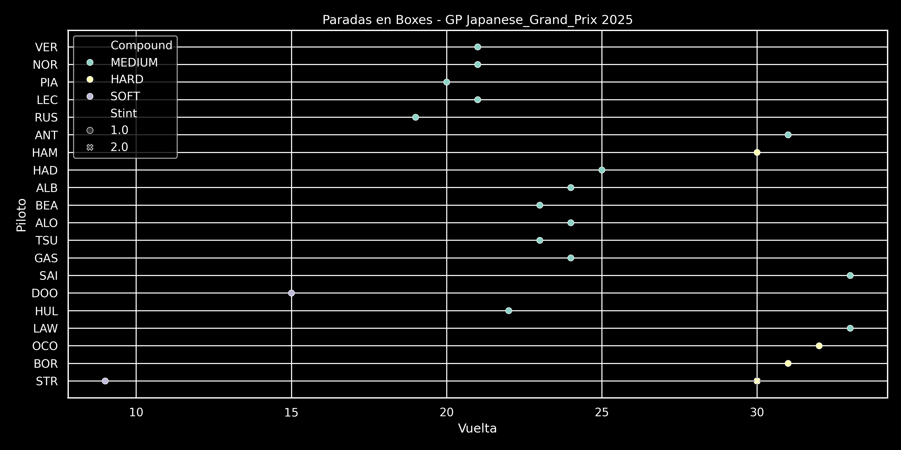
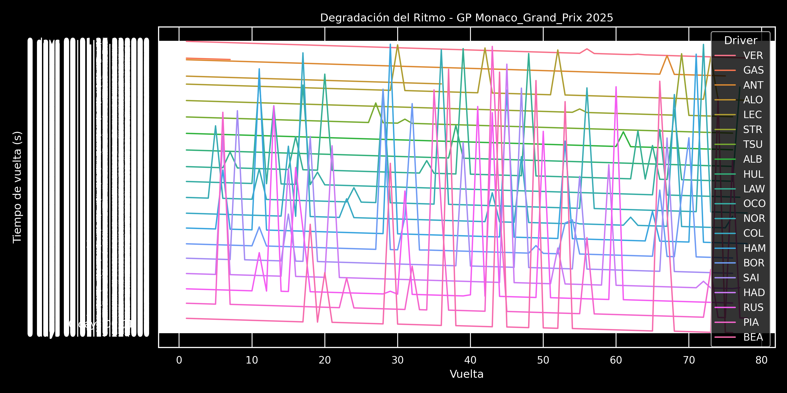

# F1 Temporada 2025 – Análisis de Datos

F1 Temporada 2025 Data Análisis es un proyecto de análisis de datos
de Fórmula 1 utilizando la librería FastF1 para obtener datos oficiales
de cada Gran Premio de la temporada 2025. El objetivo es generar
visualizaciones interactivas y gráficas de ritmo de carrera,
estrategias de neumáticos, paradas en boxes, degradación del
rendimiento y otros aspectos clave de las carreras. El proyecto
emplea Python junto con bibliotecas como Matplotlib, Seaborn y
Plotly para producir análisis visuales y reportes.

# Clasificación del Gran Premio de Australia 2025

| Posición | Piloto                     | Equipo                        | Tiempo/Diferencia | Notas                     |
|----------|----------------------------|-------------------------------|-------------------|---------------------------|
| 1        | Lando Norris              | McLaren-Mercedes              | 1:42:06.304       | Pole, Vuelta rápida       |
| 2        | Max Verstappen            | Red Bull-Honda RBPT           | +0.895            |                           |
| 3        | George Russell            | Mercedes                      | +8.481            |                           |
| 4        | Andrea Kimi Antonelli     | Mercedes                      | +10.135           |                           |
| 5        | Alexander Albon           | Williams-Mercedes             | +12.773           |                           |
| 6        | Lance Stroll              | Aston Martin-Mercedes         | +17.413           |                           |
| 7        | Nico Hülkenberg           | Kick Sauber-Ferrari           | +18.423           |                           |
| 8        | Charles Leclerc           | Ferrari                       | +19.826           |                           |
| 9        | Oscar Piastri             | McLaren-Mercedes              | +20.448           |                           |
| 10       | Lewis Hamilton            | Ferrari                       | +22.473           |                           |
| 11       | Pierre Gasly              | Alpine-Renault                | +26.502           |                           |
| 12       | Yuki Tsunoda              | Racing Bulls-Honda RBPT       | +29.884           |                           |
| 13       | Esteban Ocon              | Haas-Ferrari                  | +33.161           |                           |
| 14       | Oliver Bearman            | Haas-Ferrari                  | +40.351           |                           |
| DNF      | Liam Lawson               | Red Bull-Honda RBPT           | -                 | Accidente (Vuelta 46)     |
| DNF      | Gabriel Bortoleto         | Kick Sauber-Ferrari           | -                 | Accidente (Vuelta 45)     |
| DNF      | Fernando Alonso           | Aston Martin-Mercedes         | -                 | Accidente (Vuelta 32)     |
| DNF      | Carlos Sainz Jr.          | Williams-Mercedes             | -                 | Accidente (Vuelta 1)      |
| DNF      | Jack Doohan               | Alpine-Renault                | -                 | Accidente (Vuelta 1)      |
| DNF      | Isack Hadjar              | Racing Bulls-Honda RBPT       | -                 | Accidente (V. Formación)  |

## Notas
- **Fecha**: 16 de marzo de 2025
- **Circuito**: Albert Park, Melbourne
- **Vueltas**: 57 (de 58 previstas, reducidas por accidente en la vuelta de formación)
- **Condiciones**: Lluvia intermitente, tres períodos de coche de seguridad
- **Pole Position**: Lando Norris (1:15.096)
- **Vuelta Rápida**: Lando Norris (1:22.167, vuelta 43)
- **Incidentes**: La penalización inicial a Andrea Kimi Antonelli fue revisada, manteniendo su 4° puesto.

# Resumen del Gran Premio de Australia 2025
El Gran Premio de Australia 2025, celebrado el 16 de marzo en Albert Park, Melbourne,
fue una carrera intensa marcada por la lluvia intermitente y múltiples incidentes.
Lando Norris (McLaren) dominó desde la pole position, liderando de principio a fin para
lograr su tercera victoria consecutiva en Australia, con un tiempo de 1:42:06.304 y
la vuelta rápida (1:22.167). Max Verstappen (Red Bull) quedó a solo 0.895 segundos en segundo lugar,
mientras que George Russell (Mercedes) completó el podio.La carrera, reducida a 57 vueltas por
un accidente de Isack Hadjar en la vuelta de formación, tuvo tres períodos de coche de seguridad
debido a choques, incluyendo los abandonos de Carlos Sainz Jr. y Jack Doohan en la primera vuelta,
Fernando Alonso en la vuelta 32, y Liam Lawson y Gabriel Bortoleto en las vueltas 46 y 45, respectivamente.
Andrea Kimi Antonelli (Mercedes) brilló con un cuarto puesto tras la revisión de una penalización.
Las condiciones climáticas y los incidentes mantuvieron la emoción hasta el final, con McLaren
consolidando su liderazgo en el campeonato de constructores.

## Ritmo de Carrera — Australian Grand Prix 2025

## Estrategía de Neumáticos

## Evolución de Posiciones

## Paradas en Boxes

## Degradación de ritmo

# Clasificación del Gran Premio de China 2025

| Posición | Piloto                     | Equipo                        | Tiempo/Diferencia | Puntos | Notas                     |
|----------|----------------------------|-------------------------------|-------------------|--------|---------------------------|
| 1        | Oscar Piastri             | McLaren-Mercedes              | 1:30:55.026       | 25     | Pole                      |
| 2        | Lando Norris              | McLaren-Mercedes              | +9.748            | 18     | Vuelta rápida             |
| 3        | George Russell            | Mercedes                      | +11.097           | 15     |                           |
| 4        | Max Verstappen            | Red Bull-Honda RBPT           | +16.656           | 12     |                           |
| 5        | Esteban Ocon              | Haas-Ferrari                  | +49.969           | 10     |                           |
| 6        | Andrea Kimi Antonelli     | Mercedes                      | +53.748           | 8      |                           |
| 7        | Alexander Albon           | Williams-Mercedes             | +56.321           | 6      |                           |
| 8        | Oliver Bearman            | Haas-Ferrari                  | +1:01.303         | 4      |                           |
| 9        | Lance Stroll              | Aston Martin-Mercedes         | +1:10.204         | 2      |                           |
| 10       | Carlos Sainz              | Williams-Mercedes             | +1:16.387         | 1      |                           |
| 11       | Isack Hadjar              | Racing Bulls-Honda RBPT       | +1:18.875         | 0      |                           |
| 12       | Liam Lawson               | Red Bull-Honda RBPT           | +1:21.147         | 0      |                           |
| 13       | Jack Doohan               | Alpine-Renault                | +1:28.401         | 0      | Penalización 10s          |
| 14       | Gabriel Bortoleto         | Kick Sauber-Ferrari           | +1 vuelta         | 0      |                           |
| 15       | Nico Hülkenberg           | Kick Sauber-Ferrari           | +1 vuelta         | 0      |                           |
| 16       | Yuki Tsunoda              | Racing Bulls-Honda RBPT       | +1 vuelta         | 0      |                           |
| DNF      | Fernando Alonso           | Aston Martin-Mercedes         | -                 | 0      | Abandono (Vuelta 4)       |
| DSQ      | Charles Leclerc           | Ferrari                       | -                 | 0      | Coche con peso insuficiente |
| DSQ      | Lewis Hamilton            | Ferrari                       | -                 | 0      | Desgaste excesivo del skid |
| DSQ      | Pierre Gasly              | Alpine-Renault                | -                 | 0      | Coche con peso insuficiente |

## Notas
- **Fecha**: 23 de marzo de 2025
- **Circuito**: Shanghai International Circuit, Shanghai
- **Vueltas**: 56
- **Condiciones**: Nublado
- **Pole Position**: Oscar Piastri (1:30.641)
- **Vuelta Rápida**: Lando Norris (1:35.454, vuelta 53)
- **Incidentes**:
  - Descalificaciones de Charles Leclerc y Pierre Gasly por coches con peso insuficiente.
  - Descalificación de Lewis Hamilton por desgaste excesivo del skid.
  - Jack Doohan recibió una penalización de 10 segundos por forzar a otro piloto fuera de pista.
  - Fernando Alonso abandonó en la vuelta 4 por problemas de frenos.
- **Hito**: McLaren logró su 50º final 1-2 en un Gran Premio.

## Resumen del Gran Premio de China 2025
El Gran Premio de China 2025, celebrado el 23 de marzo en el Shanghai International Circuit,
fue una carrera dominada por McLaren, que logró un histórico 1-2. Oscar Piastri partió
desde la pole (1:30.641) y lideró de principio a fin, ganando con un tiempo de 1:30:55.026.
Lando Norris aseguró el segundo puesto a 9.748 segundos, marcando también la vuelta rápida (1:35.454).
George Russell (Mercedes) completó el podio, seguido de cerca por Max Verstappen (Red Bull).
La carrera, disputada en condiciones nubladas y sin lluvia, tuvo pocos incidentes en pista,
pero estuvo marcada por controversias post-carrera. Charles Leclerc y Pierre Gasly fueron descalificados
por coches con peso insuficiente, mientras que Lewis Hamilton lo fue por desgaste excesivo del skid.
Fernando Alonso abandonó en la vuelta 4 por problemas de frenos, y Jack Doohan (Alpine)
recibió una penalización de 10 segundos por forzar a otro piloto fuera de pista.
La actuación de Haas, con Esteban Ocon y Oliver Bearman en quinto y octavo lugar,
fue destacada. Este resultado consolidó el dominio de McLaren en el campeonato de constructores,
marcando su 50º final 1-2 en la historia de la Fórmula 1.

## Estrategía de Neumáticos

## Evolución de Posiciones

## Paradas en Boxes

## Degradación de ritmo

# Gran Premio de Japón

## Clasificación de Largada del Gran Premio de Japón 2025

| Posición | Piloto                     | Equipo                        | Tiempo Q3         | Notas                     |
|----------|----------------------------|-------------------------------|-------------------|---------------------------|
| 1        | Max Verstappen             | Red Bull-Honda RBPT           | 1:26.983          | Pole                      |
| 2        | Lando Norris              | McLaren-Mercedes              | 1:26.995          |                           |
| 3        | Oscar Piastri             | McLaren-Mercedes              | 1:27.027          |                           |
| 4        | Charles Leclerc           | Ferrari                       | 1:27.299          |                           |
| 5        | George Russell            | Mercedes                      | 1:27.318          |                           |
| 6        | Andrea Kimi Antonelli     | Mercedes                      | 1:27.555          |                           |
| 7        | Isack Hadjar              | Racing Bulls-Honda RBPT       | 1:27.569          |                           |
| 8        | Lewis Hamilton            | Ferrari                       | 1:27.610          |                           |
| 9        | Alexander Albon           | Williams-Mercedes             | 1:27.615          |                           |
| 10       | Oliver Bearman            | Haas-Ferrari                  | 1:27.867          |                           |
| 11       | Pierre Gasly              | Alpine-Renault                | 1:27.822          |                           |
| 12       | Fernando Alonso           | Aston Martin-Mercedes         | 1:27.897          |                           |
| 13       | Liam Lawson               | Racing Bulls-Honda RBPT       | 1:27.906          |                           |
| 14       | Yuki Tsunoda              | Red Bull-Honda RBPT           | 1:28.000          |                           |
| 15       | Carlos Sainz              | Williams-Mercedes             | 1:27.836          | Penalización 3 posiciones  |
| 16       | Nico Hülkenberg           | Kick Sauber-Ferrari           | 1:28.570          |                           |
| 17       | Gabriel Bortoleto         | Kick Sauber-Ferrari           | 1:28.622          |                           |
| 18       | Esteban Ocon              | Haas-Ferrari                  | 1:28.696          |                           |
| 19       | Jack Doohan               | Alpine-Renault                | 1:28.877          |                           |
| 20       | Lance Stroll              | Aston Martin-Mercedes         | 1:29.271          |                           |

## Notas
- **Fecha**: 5 de abril de 2025 (Clasificación)
- **Circuito**: Suzuka International Racing Course, Suzuka
- **Condiciones**: Seco, sin incidentes climáticos significativos
- **Pole Position**: Max Verstappen (1:26.983, nuevo récord de vuelta en Suzuka)
- **Penalización**: Carlos Sainz recibió una penalización de 3 posiciones por obstaculizar a Lewis Hamilton en Q2, cayendo del 12° al 15° puesto.
- **Hitos**:
  - Cuarta pole consecutiva de Max Verstappen en Japón.
  - 104ª pole de Red Bull como constructor, 23ª para Honda RBPT como motorista.
  - Promedio de velocidad de pole: 240.337 km/h.
- **Observaciones**:
  - Isack Hadjar destacó con un séptimo puesto a pesar de problemas con el cinturón de seguridad.
  - Yuki Tsunoda, en su debut con Red Bull en su carrera local, no alcanzó Q3, quedando 14°.

## Resumen
El Gran Premio de Japón 2025, disputado el 6 de abril en el Suzuka International
Circuit, vio a Max Verstappen (Red Bull) conseguir su primera victoria de la
temporada, completando las 53 vueltas en 1:22:06.983. Partiendo desde la pole
(1:26.983), Verstappen mantuvo a raya a los McLaren de Lando Norris y Oscar
Piastri, que terminaron segundo (+1.423) y tercero (+2.129), respectivamente,
en una carrera en seco donde la lluvia, esperada, no apareció. La pista, conocida
por su dificultad para adelantar, limitó las batallas en pista, haciendo clave
la estrategia y la gestión de neumáticos, que mostró poca degradación.Un momento
crítico ocurrió en la vuelta 22, cuando Verstappen y Norris entraron juntos a
boxes. McLaren ejecutó una parada más rápida, permitiendo a Norris salir en
paralelo, pero Verstappen mantuvo la posición al obligar al británico a salirse
a la hierba, sin investigación posterior. Piastri, con mejor ritmo, se acercó a
Norris en las últimas vueltas, pero McLaren no cambió posiciones, perdiendo una
posible oportunidad de atacar a Verstappen. Kimi Antonelli (Mercedes) destacó,
liderando temporalmente (récord como el piloto más joven en hacerlo) y marcando
la vuelta rápida (1:31.072), terminando sexto. Charles Leclerc (Ferrari) y
George Russell (Mercedes) completaron el top 5.Fernando Alonso (Aston Martin)
brilló en la primera vuelta, adelantando a Pierre Gasly para acabar undécimo,
rozando los puntos. Carlos Sainz (Williams), penalizado con tres posiciones en
la parrilla (15°), luchó pero finalizó 14°. Sin incidentes mayores, la carrera
fue estratégica, con Verstappen consolidando su candidatura al título,
quedando a un punto de Norris en el campeonato. McLaren mantuvo su dominio en constructores.

## Estrategía de Neumáticos

## Evolución de Posiciones

## Paradas en Boxes

## Degradación de ritmo

# Gran Premio de Bahrain

## Clasificación del Gran Premio de Bahréin 2025

| Posición | Piloto                     | Equipo                        | Tiempo/Diferencia | Puntos | Notas                     |
|----------|----------------------------|-------------------------------|-------------------|--------|---------------------------|
| 1        | Oscar Piastri             | McLaren-Mercedes              | 1:35:39.435       | 25     | Pole, Vuelta rápida       |
| 2        | George Russell            | Mercedes                      | +15.499           | 18     |                           |
| 3        | Lando Norris              | McLaren-Mercedes              | +16.273           | 15     | Penalización 5s           |
| 4        | Charles Leclerc           | Ferrari                       | +19.679           | 12     |                           |
| 5        | Lewis Hamilton            | Ferrari                       | +27.993           | 10     |                           |
| 6        | Max Verstappen            | Red Bull-Honda RBPT           | +34.395           | 8      |                           |
| 7        | Pierre Gasly              | Alpine-Renault                | +36.002           | 6      |                           |
| 8        | Esteban Ocon              | Haas-Ferrari                  | +44.244           | 4      |                           |
| 9        | Yuki Tsunoda              | Red Bull-Honda RBPT           | +45.061           | 2      |                           |
| 10       | Oliver Bearman            | Haas-Ferrari                  | +47.594           | 1      |                           |
| 11       | Andrea Kimi Antonelli     | Mercedes                      | +48.016           | 0      |                           |
| 12       | Alexander Albon           | Williams-Mercedes             | +48.839           | 0      |                           |
| 13       | Isack Hadjar              | Racing Bulls-Honda RBPT       | +56.314           | 0      |                           |
| 14       | Jack Doohan               | Alpine-Renault                | +57.806           | 0      | Penalización 5s           |
| 15       | Fernando Alonso           | Aston Martin-Mercedes         | +1:00.340         | 0      |                           |
| 16       | Liam Lawson               | Racing Bulls-Honda RBPT       | +1:04.435         | 0      | Penalización 15s          |
| 17       | Lance Stroll              | Aston Martin-Mercedes         | +1:05.489         | 0      |                           |
| 18       | Gabriel Bortoleto         | Kick Sauber-Ferrari           | +1:06.872         | 0      |                           |
| DNF      | Carlos Sainz              | Williams-Mercedes             | -                 | 0      | Colisión (Vuelta 45)      |
| DSQ      | Nico Hülkenberg           | Kick Sauber-Ferrari           | -                 | 0      | Desgaste excesivo skid    |

## Notas
- **Fecha**: 13 de abril de 2025
- **Circuito**: Bahrain International Circuit, Sakhir
- **Vueltas**: 57
- **Condiciones**: Seco, 26°C, carrera nocturna
- **Pole Position**: Oscar Piastri (1:29.841)
- **Vuelta Rápida**: Oscar Piastri (1:35.140, vuelta 36)
- **Incidentes**:
  - **Penalizaciones**: Lando Norris (5s, posición incorrecta en parrilla), Jack Doohan (5s, exceder límites de pista), Liam Lawson (15s, colisiones con Stroll y Hülkenberg).
  - **Descalificación**: Nico Hülkenberg, por desgaste excesivo del skid block.
  - **Abandono**: Carlos Sainz, daños por colisión con Yuki Tsunoda (vuelta 45).
  - **Coche de Seguridad**: Desplegado en vuelta 31 por restos en pista tras colisión Tsunoda-Sainz.
- **Hitos**:
  - Primera victoria de McLaren en Bahréin.
  - Oscar Piastri logró el hat-trick (pole, victoria y vuelta rápida), el primero de su carrera.
  - 50º Gran Premio de Oscar Piastri.

  ## Resumen
  El Gran Premio de Bahréin 2025, disputado el 13 de abril en el Bahrain
  International Circuit bajo condiciones nocturnas (26°C, seco), fue dominado por
  Oscar Piastri (McLaren), quien logró su segunda victoria de la temporada y el
  primer hat-trick de su carrera (pole: 1:29.841, victoria: 1:35:39.435, vuelta
  rápida: 1:35.140). Piastri lideró de principio a fin, consolidando el fuerte
  inicio de McLaren en el campeonato. George Russell (Mercedes) terminó segundo
  a 15.499 segundos, mientras que Lando Norris (McLaren) completó el podio en
  tercero, a pesar de una penalización de 5 segundos por posición incorrecta en
  la parrilla.La carrera, de 57 vueltas, tuvo momentos de tensión, especialmente
  una colisión en la vuelta 45 entre Yuki Tsunoda (Red Bull) y Carlos Sainz (Williams),
  que dejó restos en pista, desencadenó un coche de seguridad y forzó el
  abandono de Sainz. Nico Hülkenberg (Kick Sauber) fue descalificado tras la
  carrera por desgaste excesivo del skid block. Otros incidentes incluyeron
  penalizaciones a Jack Doohan (Alpine, 5s por exceder límites de pista)
  y Liam Lawson (Racing Bulls, 15s por colisiones con Stroll y Hülkenberg).
  Ferrari mostró ritmo sólido con Charles Leclerc (4°) y Lewis Hamilton (5°),
  mientras que Max Verstappen (Red Bull) tuvo una carrera discreta, terminando sexto.
  La carrera destacó por la estrategia de neumáticos y la gestión en condiciones estables,
  con McLaren reforzando su liderazgo en el campeonato de constructores y Piastri
  celebrando su 50º Gran Premio con una actuación impecable.

## Analisis

## Estrategía de Neumáticos

## Evolución de Posiciones

## Paradas en Boxes

## Degradación de ritmo

# Gran Premio de Arabia Saudita

## Clasificación de Largada del Gran Premio de Arabia Saudita 2025

| Posición | Piloto                     | Equipo                        | Tiempo Q3         | Notas                     |
|----------|----------------------------|-------------------------------|-------------------|---------------------------|
| 1        | Max Verstappen             | Red Bull-Honda RBPT           | 1:27.294          | Pole                      |
| 2        | Oscar Piastri             | McLaren-Mercedes              | 1:27.304          |                           |
| 3        | George Russell            | Mercedes                      | 1:27.407          |                           |
| 4        | Charles Leclerc           | Ferrari                       | 1:27.670          |                           |
| 5        | Andrea Kimi Antonelli     | Mercedes                      | 1:27.866          |                           |
| 6        | Carlos Sainz              | Williams-Mercedes             | 1:28.164          |                           |
| 7        | Lewis Hamilton            | Ferrari                       | 1:28.201          |                           |
| 8        | Yuki Tsunoda              | Red Bull-Honda RBPT           | 1:28.204          |                           |
| 9        | Pierre Gasly              | Alpine-Renault                | 1:28.367          |                           |
| 10       | Lando Norris              | McLaren-Mercedes              | Sin tiempo        | Accidente en Q3           |
| 11       | Alexander Albon           | Williams-Mercedes             | 1:28.109          | Eliminado en Q2           |
| 12       | Liam Lawson               | Racing Bulls-Honda RBPT       | 1:28.191          | Eliminado en Q2           |
| 13       | Fernando Alonso           | Aston Martin-Mercedes         | 1:28.303          | Eliminado en Q2           |
| 14       | Isack Hadjar              | Racing Bulls-Honda RBPT       | 1:28.418          | Eliminado en Q2           |
| 15       | Oliver Bearman            | Haas-Ferrari                  | 1:28.648          | Eliminado en Q2           |
| 16       | Lance Stroll              | Aston Martin-Mercedes         | 1:28.645          | Eliminado en Q1           |
| 17       | Jack Doohan               | Alpine-Renault                | 1:28.739          | Eliminado en Q1           |
| 18       | Nico Hülkenberg           | Kick Sauber-Ferrari           | 1:28.782          | Eliminado en Q1           |
| 19       | Esteban Ocon              | Haas-Ferrari                  | 1:29.092          | Eliminado en Q1           |
| 20       | Gabriel Bortoleto         | Kick Sauber-Ferrari           | 1:29.462          | Eliminado en Q1           |

## Notas
- **Fecha**: 19 de abril de 2025 (Clasificación)
- **Circuito**: Jeddah Corniche Circuit, Yeda
- **Condiciones**: Seco, 32°C, carrera nocturna
- **Pole Position**: Max Verstappen (1:27.294, 42ª pole en F1)
- **Incidentes**:
  - **Accidente de Lando Norris**: Norris, líder del campeonato, chocó contra el muro en la curva 5 durante Q3, causando una bandera roja y sin tiempo registrado, partirá 10°.
  - **Penalización investigada**: Liam Lawson fue investigado por una salida peligrosa en Q2, pero no se aplicaron sanciones en la parrilla.
- **Hitos**:
  - Verstappen logró su segunda pole de 2025, superando a Oscar Piastri por solo 0.010 segundos.
  - Carlos Sainz logró su mejor posición de largada del año (6°).
  - Fernando Alonso, eliminado en Q2, partirá 13° tras una competitiva sesión.

## Resumen
El Gran Premio de Arabia Saudita 2025, disputado el 20 de abril en el Jeddah Corniche Circuit,
fue una carrera vibrante bajo las luces, marcada por un inicio caótico y una
actuación estelar de Oscar Piastri (McLaren). Piastri, partiendo desde la
segunda posición, aprovechó un error de Max Verstappen (Red Bull) en la primera
curva, donde el poleman cortó la curva 2, recibiendo una penalización de 5
segundos que lo relegó tras su parada en boxes. Piastri lideró con autoridad,
ganando en 1:21:06.758, logrando su tercera victoria de 2025 y tomando el
liderato del campeonato de pilotos, el primer australiano en hacerlo desde
Mark Webber en 2010. Verstappen terminó segundo (+2.843s), y
Charles Leclerc (Ferrari) logró su primer podio del año en tercero (+8.104s).
La carrera comenzó con un choque en la primera vuelta entre Yuki Tsunoda
(Red Bull) y Pierre Gasly (Alpine), que provocó un coche de seguridad y el
abandono de ambos. Lando Norris (McLaren), partiendo décimo tras un accidente
en Q3, remontó hasta el cuarto puesto, marcando la vuelta rápida (1:31.778).
George Russell y Kimi Antonelli (Mercedes) terminaron quinto y sexto, mientras
que Lewis Hamilton (Ferrari) fue séptimo. Williams brilló con Carlos Sainz (8°)
y Alexander Albon (9°), logrando su mejor resultado conjunto de la temporada.
Isack Hadjar (Racing Bulls) cerró los puntos en décimo.La estrategia de una
parada dominó, con la mayoría optando por medios a duros, aunque Norris usó
duros a medios para su remontada. Incidentes como la penalización de 10 segundos
a Liam Lawson (Racing Bulls) por ganar ventaja fuera de pista y un momento
tenso entre Fernando Alonso y Gabriel Bortoleto añadieron drama. McLaren
consolidó su liderato en constructores, mientras Piastri emergió como un serio
contendiente al título.

## Analisis

## Estrategía de Neumáticos

## Evolución de Posiciones

## Paradas en Boxes

## Degradación de ritmo

# Gran Premio de Miami
## Clasificación de Largada del Gran Premio de Miami 2025

| Posición | Piloto                     | Equipo                        | Tiempo Q3         | Notas                     |
|----------|----------------------------|-------------------------------|-------------------|---------------------------|
| 1        | Max Verstappen             | Red Bull-Honda RBPT           | 1:26.204          | Pole                      |
| 2        | Lando Norris              | McLaren-Mercedes              | 1:26.269          |                           |
| 3        | Andrea Kimi Antonelli     | Mercedes                      | 1:26.271          |                           |
| 4        | Oscar Piastri             | McLaren-Mercedes              | 1:26.375          |                           |
| 5        | George Russell            | Mercedes                      | 1:26.385          |                           |
| 6        | Carlos Sainz              | Williams-Mercedes             | 1:26.569          |                           |
| 7        | Alexander Albon           | Williams-Mercedes             | 1:26.682          |                           |
| 8        | Charles Leclerc           | Ferrari                       | 1:26.754          |                           |
| 9        | Esteban Ocon              | Haas-Ferrari                  | 1:26.824          |                           |
| 10       | Yuki Tsunoda              | Red Bull-Honda RBPT           | 1:26.943          |                           |
| 11       | Isack Hadjar              | Racing Bulls-Honda RBPT       | 1:26.987          | Eliminado en Q2           |
| 12       | Lewis Hamilton            | Ferrari                       | 1:27.006          | Eliminado en Q2           |
| 13       | Gabriel Bortoleto         | Kick Sauber-Ferrari           | 1:27.151          | Eliminado en Q2           |
| 14       | Jack Doohan               | Alpine-Renault                | 1:27.186          | Eliminado en Q2           |
| 15       | Liam Lawson               | Racing Bulls-Honda RBPT       | 1:27.363          | Eliminado en Q2           |
| 16       | Nico Hülkenberg           | Kick Sauber-Ferrari           | 1:27.473          | Eliminado en Q1           |
| 17       | Fernando Alonso           | Aston Martin-Mercedes         | 1:27.604          | Eliminado en Q1           |
| 18       | Pierre Gasly              | Alpine-Renault                | 1:27.710          | Eliminado en Q1           |
| 19       | Lance Stroll              | Aston Martin-Mercedes         | 1:27.830          | Eliminado en Q1           |
| 20       | Oliver Bearman            | Haas-Ferrari                  | 1:27.999          | Eliminado en Q1           |

## Notas
- **Fecha**: 3 de mayo de 2025 (Clasificación)
- **Circuito**: Miami International Autodrome, Miami
- **Condiciones**: Seco, 15 minutos de retraso por lluvia previa en la carrera Sprint
- **Pole Position**: Max Verstappen (1:26.204, tercera pole de 2025)
- **Incidentes**:
  - **Accidente previo**: Fernando Alonso sufrió daños en la carrera Sprint tras un choque con Liam Lawson, lo que afectó su rendimiento en Q1 (17°).
  - **Eliminaciones destacadas**: Lewis Hamilton no avanzó a Q3, quedando 12°. Charles Leclerc tuvo una vuelta anulada en Q3 por exceder límites de pista.
  - **Sprint previa**: Kimi Antonelli logró la pole para la Sprint (1:26.482), pero en la clasificación principal fue superado por Verstappen.
- **Hitos**:
  - Verstappen logró su 42ª pole en F1, consolidando su dominio en circuitos urbanos.
  - Carlos Sainz (6°) y Alexander Albon (7°) destacaron con Williams, logrando su mejor clasificación del año.
  - Kimi Antonelli, en su temporada debut, impresionó con un tercer puesto.

## Resumen del Gran Premio de Miami 2025

El Gran Premio de Miami 2025, disputado el 4 de mayo en el Miami International Autodrome,
fue un espectáculo dominado por McLaren, con Oscar Piastri logrando su cuarta
victoria de la temporada (1:28:51.587) y extendiendo su liderato en el
campeonato de pilotos. Partiendo desde la cuarta posición, Piastri superó a
Kimi Antonelli (Mercedes) en la vuelta 4 y a Max Verstappen (Red Bull) en la 14,
tras un intenso duelo en el que Verstappen, desde la pole (1:26.204), tuvo
problemas con el agarre trasero y un roce con Lando Norris en la primera curva.
Norris, a pesar de caer al sexto puesto tras el contacto, remontó hasta el
segundo lugar (+4.630s), asegurando un 1-2 para McLaren. George Russell (Mercedes)
completó el podio (+37.644s), beneficiándose de un Virtual Safety Car (VSC)
bien aprovechado.La carrera, bajo condiciones secas tras lluvias previas,
tuvo drama desde el inicio. Jack Doohan (Alpine) y Liam Lawson (Racing Bulls)
colisionaron en la primera vuelta, causando el abandono de ambos.
Gabriel Bortoleto (Sauber) y Oliver Bearman (Haas) también se retiraron por
problemas de motor, mientras Carlos Sainz (Williams) chocó con Lewis Hamilton (Ferrari)
en la última vuelta, bajo investigación post-carrera. Alex Albon (Williams)
brilló con un quinto puesto, consolidando a Williams como una fuerza en la
media tabla, mientras Ferrari decepcionó, con Charles Leclerc (7°)
y Hamilton (8°) afectados por órdenes de equipo y falta de ritmo.Un VSC en la
vuelta 29 por los restos de Bearman y otro en la 33 por el retiro de Bortoleto
marcaron la estrategia de pits, con McLaren gestionando perfectamente sus paradas.
Lando Norris marcó la vuelta rápida (1:29.746, vuelta 36). La carrera, con 275,000
espectadores, destacó el dominio de McLaren, que consolidó su liderato en constructores,
mientras Piastri se afianzó como favorito al título. El evento también marcó
el fin de la etapa de Doohan en Alpine, siendo reemplazado por Franco Colapinto
para la próxima carrera.

## Analisis

## Estrategía de Neumáticos

## Evolución de Posiciones

## Paradas en Boxes

## Degradación de ritmo

# Gran Premio de Emilia Romagna
## Clasificación
# Clasificación de Largada del Gran Premio de Emilia-Romaña 2025

| Posición | Piloto                     | Equipo                        | Tiempo Q3         | Notas                     |
|----------|----------------------------|-------------------------------|-------------------|---------------------------|
| 1        | Oscar Piastri             | McLaren-Mercedes              | 1:14.670          | Pole                      |
| 2        | Max Verstappen            | Red Bull-Honda RBPT           | 1:14.704          |                           |
| 3        | George Russell            | Mercedes                      | 1:14.807          |                           |
| 4        | Lando Norris              | McLaren-Mercedes              | 1:14.962          |                           |
| 5        | Fernando Alonso           | Aston Martin-Mercedes         | 1:15.431          |                           |
| 6        | Carlos Sainz              | Williams-Mercedes             | 1:15.432          |                           |
| 7        | Alexander Albon           | Williams-Mercedes             | 1:15.473          |                           |
| 8        | Lance Stroll              | Aston Martin-Mercedes         | 1:15.581          |                           |
| 9        | Isack Hadjar              | Racing Bulls-Honda RBPT       | 1:15.746          |                           |
| 10       | Pierre Gasly              | Alpine-Renault                | 1:15.787          |                           |
| 11       | Charles Leclerc           | Ferrari                       | 1:15.604          | Eliminado en Q2           |
| 12       | Lewis Hamilton            | Ferrari                       | 1:15.765          | Eliminado en Q2           |
| 13       | Andrea Kimi Antonelli     | Mercedes                      | 1:15.772          | Eliminado en Q2           |
| 14       | Gabriel Bortoleto         | Kick Sauber-Ferrari           | 1:16.260          | Eliminado en Q2           |
| 15       | Franco Colapinto          | Alpine-Renault                | 1:16.256          | Eliminado en Q2, Penalización 1 posición |
| 16       | Liam Lawson               | Racing Bulls-Honda RBPT       | 1:16.379          | Eliminado en Q1           |
| 17       | Nico Hülkenberg           | Kick Sauber-Ferrari           | 1:16.518          | Eliminado en Q1           |
| 18       | Esteban Ocon              | Haas-Ferrari                  | 1:16.613          | Eliminado en Q1           |
| 19       | Oliver Bearman            | Haas-Ferrari                  | 1:16.918          | Eliminado en Q1           |
| 20       | Yuki Tsunoda              | Red Bull-Honda RBPT           | Sin tiempo        | Eliminado en Q1, Accidente |

## Notas
- **Fecha**: 17 de mayo de 2025 (Clasificación)
- **Circuito**: Autodromo Enzo e Dino Ferrari, Imola
- **Condiciones**: Seco, pista complicada por gestión de neumáticos blandos
- **Pole Position**: Oscar Piastri (1:14.670, McLaren)
- **Incidentes**:
  - **Accidente de Yuki Tsunoda**: Choque en Q1 al tocar un piano, causando bandera roja; partirá 20° tras volcar, pero salió ileso.
  - **Accidente de Franco Colapinto**: Choque en Q1, pero avanzó a Q2 con tiempo previo; penalización de 1 posición por salir antes de tiempo tras reanudación.
  - **Eliminaciones sorpresivas**: Ferrari decepcionó con Charles Leclerc (11°) y Lewis Hamilton (12°) fuera de Q3, al igual que Kimi Antonelli (13°, Mercedes).
  - **Retraso en Q2**: La FIA retrasó Q2 para revisar el tiempo de Oliver Bearman, anulado por bandera roja, generando críticas por la gestión.
- **Hitos**:
  - Oscar Piastri logró su segunda pole de 2025, superando a Max Verstappen por 0.034 segundos.
  - Fernando Alonso (5°) y Carlos Sainz (6°) lograron su mejor clasificación de la temporada, destacando las mejoras de Aston Martin y Williams.
  - Isack Hadjar (9°) superó a su compañero Yuki Tsunoda, consolidando su buen momento con Racing Bulls.

## Resumen:
El Gran Premio de Emilia-Romaña 2025, disputado el 18 de mayo en el
Autodromo Enzo e Dino Ferrari, Imola, fue una carrera estratégica marcada por un
inicio audaz y dos interrupciones clave. Max Verstappen (Red Bull) se llevó la
victoria (1:31:33.199), su segunda de la temporada, tras superar al poleman
Oscar Piastri (McLaren) en la curva Tamburello de la primera vuelta con una
maniobra arriesgada por el exterior. Lando Norris (McLaren) remontó desde el
cuarto puesto para terminar segundo (+6.109s), adelantando a Piastri (+12.956s)
en la vuelta 58 tras un Safety Car tardío, asegurando un podio 2-3 para McLaren.
Lewis Hamilton (Ferrari) brilló con una recuperación desde el 12° hasta
el 4° puesto, mientras Alexander Albon (Williams) logró un sólido 5°.
La carrera, de 63 vueltas, se vio alterada por un Virtual Safety Car (vuelta 29)
tras el abandono de Esteban Ocon (Haas) por fallo mecánico y un Safety Car
completo (vuelta 46) por el retiro de Kimi Antonelli (Mercedes) en una
posición peligrosa. Estos incidentes beneficiaron a Verstappen, que gestionó su
ventaja tras su parada en boxes, y permitieron a Norris superar a Piastri, quien
sufrió con el timing de las paradas. Charles Leclerc (Ferrari) remontó al
6° desde el 11°, pero Ferrari decepcionó en casa. Yuki Tsunoda (Red Bull), tras
un accidente en Q1, remontó desde el pitlane al 10°, sumando un punto.Williams
destacó con Carlos Sainz (8°) y Albon, mientras Isack Hadjar (Racing Bulls)
puntuó en 9°. La pista, conocida por su dificultad para adelantar, puso
énfasis en la estrategia de neumáticos (C4-C6 de Pirelli) y la clasificación,
con McLaren manteniendo su liderato en constructores y Piastri liderando el
campeonato de pilotos por 13 puntos sobre Norris. El evento, con 242,000
espectadores, marcó el 400º Gran Premio de Red Bull y el último de Imola en el
calendario de F1, ya que no está programado para 2026.

## Estrategía de Neumáticos

## Evolución de Posiciones

## Paradas en Boxes

## Degradación de ritmo

# Monaco Grand Prix
## Clasificación de Largada del Gran Premio de Mónaco 2025

| Posición | Piloto                     | Equipo                        | Tiempo Q3         | Notas                     |
|----------|----------------------------|-------------------------------|-------------------|---------------------------|
| 1        | Lando Norris              | McLaren-Mercedes              | 1:09.954          | Pole, Récord de pista     |
| 2        | Charles Leclerc           | Ferrari                       | 1:10.063          |                           |
| 3        | Oscar Piastri             | McLaren-Mercedes              | 1:10.129          |                           |
| 4        | Max Verstappen            | Red Bull-Honda RBPT           | 1:10.669          |                           |
| 5        | Isack Hadjar              | Racing Bulls-Honda RBPT       | 1:10.923          |                           |
| 6        | Fernando Alonso           | Aston Martin-Mercedes         | 1:10.924          |                           |
| 7        | Lewis Hamilton            | Ferrari                       | 1:10.382          | Penalización 3 posiciones  |
| 8        | Esteban Ocon              | Haas-Ferrari                  | 1:10.942          |                           |
| 9        | Liam Lawson               | Racing Bulls-Honda RBPT       | 1:11.129          |                           |
| 10       | Alexander Albon           | Williams-Mercedes             | 1:11.213          |                           |
| 11       | Carlos Sainz              | Williams-Mercedes             | 1:11.362          | Eliminado en Q2           |
| 12       | Yuki Tsunoda              | Red Bull-Honda RBPT           | 1:11.415          | Eliminado en Q2           |
| 13       | Nico Hülkenberg           | Kick Sauber-Ferrari           | 1:11.596          | Eliminado en Q2           |
| 14       | George Russell            | Mercedes                      | Sin tiempo        | Eliminado en Q2, Problemas técnicos |
| 15       | Kimi Antonelli            | Mercedes                      | Sin tiempo        | Eliminado en Q2, Accidente Q1 |
| 16       | Gabriel Bortoleto         | Kick Sauber-Ferrari           | 1:11.902          | Eliminado en Q1           |
| 17       | Pierre Gasly              | Alpine-Renault                | 1:11.994          | Eliminado en Q1           |
| 18       | Franco Colapinto          | Alpine-Renault                | 1:12.597          | Eliminado en Q1           |
| 19       | Lance Stroll              | Aston Martin-Mercedes         | 1:12.563          | Eliminado en Q1, Penalización 1 posición |
| 20       | Oliver Bearman            | Haas-Ferrari                  | 1:11.979          | Eliminado en Q1, Penalización 10 posiciones |

## Notas
- **Fecha**: 24 de mayo de 2025 (Clasificación)
- **Circuito**: Circuito de Mónaco, Montecarlo (3.337 km)
- **Condiciones**: Seco, 21.3°C, asfalto 39°C, humedad 59%
- **Pole Position**: Lando Norris (1:09.954, nuevo récord de pista, 11ª pole en F1, 2ª de 2025)
- **Incidentes**:
  - **Penalizaciones**: Lewis Hamilton recibió una penalización de 3 posiciones por obstaculizar a Max Verstappen. Lance Stroll penalizado con 1 posición y Oliver Bearman con 10 posiciones por incidentes en entrenamientos libres.
  - **Accidentes**: Kimi Antonelli chocó en Q1 (salida del túnel), causando bandera roja y daños que lo excluyeron de Q2. Franco Colapinto fue afectado por esta bandera roja, quedando 20°.
  - **Problemas técnicos**: George Russell sufrió una pérdida de potencia en el túnel durante Q2, causando otra bandera roja y quedando sin tiempo.
  - **Eliminaciones destacadas**: Ferrari decepcionó con Charles Leclerc (2°) perdiendo la pole ante Norris. Carlos Sainz (11°) y Yuki Tsunoda (12°) no avanzaron a Q3.
- **Hitos**:
  - Lando Norris logró la pole más rápida en la historia de Mónaco, superando el récord anterior de Charles Leclerc (1:10.270 en 2024).
  - Fernando Alonso (6°) logró su mejor clasificación de 2025, destacando las mejoras de Aston Martin.
  - Isack Hadjar (5°) impresionó en jsu primera clasificación en Mónaco con Racing Bulls.

## Resumen de la carrera:
El Gran Premio de Mónaco 2025, disputado el 25 de mayo en el Circuito de Mónaco,
fue una carrera estratégica marcada por la precisión y el drama en las estrechas
calles de Montecarlo. Lando Norris (McLaren) convirtió su pole position
(1:09.954, récord de pista) en una victoria magistral (1:40:33.843), la
segunda de su temporada, liderando de principio a fin y marcando la vuelta rápida
(1:13.221, vuelta 78). Charles Leclerc (Ferrari) emocionó a los aficionados
locales con un segundo puesto (+3.131s), mientras que Oscar Piastri (McLaren)
completó el podio (+3.658s), asegurando un 1-3 para McLaren, su primera victoria en Mónaco desde 2008.

La carrera, de 78 vueltas, estuvo condicionada por una nueva regla de dos paradas
obligatorias con tres compuestos de neumáticos, diseñada para añadir estrategia,
pero que no evitó que la dificultad para adelantar en Mónaco definiera la carrera.
El inicio vio drama inmediato: Gabriel Bortoleto (Sauber) chocó contra las
barreras en Portier tras un intento de adelantamiento de Kimi Antonelli
(Mercedes), desencadenando un Virtual Safety Car (VSC) en la vuelta 1.
Esto permitió paradas tempranas de Yuki Tsunoda, Pierre Gasly y Oliver Bearman.
En la vuelta 9, Gasly chocó contra Tsunoda en la Nouvelle Chicane por un fallo
de frenos, retirándose y dejando escombros que se limpiaron bajo banderas amarillas.

## Estrategía de Neumáticos

## Evolución de Posiciones

## Paradas en Boxes

## Degradación de ritmo

# Gran Preio de España
## Clasificación de Largada del Gran Premio de España 2025

| Posición | Piloto                     | Equipo                        | Tiempo Q3         | Notas                     |
|----------|----------------------------|-------------------------------|-------------------|---------------------------|
| 1        | Oscar Piastri             | McLaren-Mercedes              | 1:12.041          | Pole                      |
| 2        | Lando Norris              | McLaren-Mercedes              | 1:12.241          |                           |
| 3        | Max Verstappen            | Red Bull-Honda RBPT           | 1:12.312          |                           |
| 4        | Charles Leclerc           | Ferrari                       | 1:12.456          |                           |
| 5        | George Russell            | Mercedes                      | 1:12.581          |                           |
| 6        | Isack Hadjar              | Racing Bulls-Honda RBPT       | 1:12.673          |                           |
| 7        | Kimi Antonelli            | Mercedes                      | 1:12.789          |                           |
| 8        | Fernando Alonso           | Aston Martin-Mercedes         | 1:12.974          |                           |
| 9        | Lewis Hamilton            | Ferrari                       | 1:13.013          |                           |
| 10       | Esteban Ocon              | Haas-Ferrari                  | 1:13.126          |                           |
| 11       | Alexander Albon           | Williams-Mercedes             | 1:13.245          | Eliminado en Q2           |
| 12       | Liam Lawson               | Racing Bulls-Honda RBPT       | 1:13.389          | Eliminado en Q2           |
| 13       | Carlos Sainz              | Williams-Mercedes             | 1:13.402          | Eliminado en Q2           |
| 14       | Pierre Gasly              | Alpine-Renault                | 1:13.567          | Eliminado en Q2           |
| 15       | Oliver Bearman            | Haas-Ferrari                  | 1:13.782          | Eliminado en Q2           |
| 16       | Gabriel Bortoleto         | Kick Sauber-Ferrari           | 1:13.891          | Eliminado en Q1           |
| 17       | Nico Hülkenberg           | Kick Sauber-Ferrari           | 1:14.012          | Eliminado en Q1           |
| 18       | Franco Colapinto          | Alpine-Renault                | 1:14.156          | Eliminado en Q1, Problema técnico |
| 19       | Yuki Tsunoda              | Red Bull-Honda RBPT           | 1:14.297          | Eliminado en Q1           |
| 20       | Lance Stroll              | Aston Martin-Mercedes         | Sin tiempo        | No participó, Lesión      |

## Notas
- **Fecha**: 31 de mayo de 2025 (Clasificación)
- **Circuito**: Circuit de Barcelona-Catalunya, Montmeló (4.657 km)
- **Condiciones**: Seco, asfalto mejorando tras lluvias previas
- **Pole Position**: Oscar Piastri (1:12.041, McLaren, tercera pole de 2025)
- **Incidentes**:
  - **Problema técnico de Franco Colapinto**: El piloto argentino de Alpine sufrió un fallo en su monoplaza A525 al salir de boxes en Q1, quedándose varado dos veces y sin poder completar una tercera vuelta, por lo que partirá 18°.
  - **No participación de Lance Stroll**: Stroll se ausentó por una lesión, dejando a Aston Martin con un solo coche (Alonso).
  - **Eliminaciones destacadas**: Carlos Sainz (13°, Williams) no avanzó a Q3, afectado por el equilibrio del coche. Yuki Tsunoda (19°, Red Bull) tuvo una sesión decepcionante.
- **Hitos**:
  - McLaren dominó con un 1-2 en la clasificación, con Piastri superando a Norris por 0.2 segundos
  - Fernando Alonso (8°) logró una sólida posición para Aston Martin, mostrando mejoras en el AMR25
  - Isack Hadjar (6°, Racing Bulls) destacó con su mejor clasificación de la temporada.

## Resumen del Gran Premio de España 2025
El Gran Premio de España 2025, disputado el 1 de junio en el Circuit de
Barcelona-Catalunya, fue una carrera dominada por McLaren, con Oscar Piastri
logrando su quinta victoria de la temporada (1:29:24.615) desde la pole position
(1:12.041). Piastri mantuvo el liderato desde la salida, ampliando su ventaja en
el campeonato de pilotos a 10 puntos. Lando Norris aseguró el segundo puesto
(+1.398s) tras superar a Max Verstappen (Red Bull) en la vuelta 1, completando
un nuevo 1-2 para McLaren. Charles Leclerc (Ferrari) cerró el podio (+7.842s),
capitalizando una penalización de 10 segundos a Verstappen por colisionar con
George Russell (Mercedes), lo que relegó al neerlandés al décimo lugar.La
carrera, de 66 vueltas, estuvo marcada por dos interrupciones: un Virtual
Safety Car (vuelta 29) por el abandono de Esteban Ocon (Haas) debido a un
fallo mecánico y un Safety Car (vuelta 61) tras el accidente de Kimi Antonelli
(Mercedes) en la curva 10, que también forzó el retiro de Alexander Albon
(Williams) por daños colaterales. La relanzada tras el Safety Car favoreció a
los McLaren, que usaron neumáticos blandos frente al duro de Verstappen,
asegurando el doblete. Nico Hülkenberg (Sauber) sorprendió con un sexto puesto,
mientras Fernando Alonso (Aston Martin) remontó desde el octavo lugar para
terminar noveno (+37.892s), sumando sus primeros puntos de 2025 tras adelantar
a Liam Lawson (Racing Bulls) en las últimas vueltas. Carlos Sainz (Williams)
tuvo un fin de semana complicado, partiendo 13° y finalizando 11°, fuera de
los puntos.Lance Stroll (Aston Martin) no participó debido a dolores en la mano,
dejando a Alonso como único representante del equipo. La carrera destacó por la
estrategia de neumáticos (blandos predominantes tras el Safety Car) y el fuerte
ritmo de McLaren, que consolidó su liderato en el campeonato de constructores.
Los 140,000 espectadores disfrutaron de una carrera vibrante, con Alonso
celebrando su resultado como un hito para Aston Martin en el 75º aniversario de la Fórmula 1.

## Estrategía de Neumáticos

## Evolución de Posiciones

## Paradas en Boxes

## Degradación de ritmo

# Gran Premio de Canada
## Clasificación de Largada del Gran Premio de Canadá 2025

| Posición | Piloto                     | Equipo                        | Tiempo Q3         | Notas                     |
|----------|----------------------------|-------------------------------|-------------------|---------------------------|
| 1        | George Russell            | Mercedes                      | 1:10.899          | Pole                      |
| 2        | Max Verstappen            | Red Bull-Honda RBPT           | 1:10.934          |                           |
| 3        | Oscar Piastri             | McLaren-Mercedes              | 1:11.103          |                           |
| 4        | Kimi Antonelli            | Mercedes                      | 1:11.186          |                           |
| 5        | Lando Norris              | McLaren-Mercedes              | 1:11.248          |                           |
| 6        | Fernando Alonso           | Aston Martin-Mercedes         | 1:11.586          |                           |
| 7        | Charles Leclerc           | Ferrari                       | 1:11.654          |                           |
| 8        | Lewis Hamilton            | Ferrari                       | 1:11.829          |                           |
| 9        | Esteban Ocon              | Haas-Ferrari                  | 1:12.154          | Penalización 3 posiciones  |
| 10       | Franco Colapinto          | Alpine-Renault                | 1:11.973          | Avanzó a Q2               |
| 11       | Isack Hadjar              | Racing Bulls-Honda RBPT       | 1:11.892          | Penalización 3 posiciones  |
| 12       | Oliver Bearman            | Haas-Ferrari                  | 1:12.013          | Eliminado en Q2           |
| 13       | Nico Hülkenberg           | Kick Sauber-Ferrari           | 1:12.109          | Eliminado en Q2           |
| 14       | Gabriel Bortoleto         | Kick Sauber-Ferrari           | 1:12.245          | Eliminado en Q2           |
| 15       | Liam Lawson               | Racing Bulls-Honda RBPT       | 1:12.387          | Eliminado en Q2           |
| 16       | Carlos Sainz              | Williams-Mercedes             | 1:12.497          | Eliminado en Q1           |
| 17       | Alexander Albon           | Williams-Mercedes             | 1:12.604          | Eliminado en Q1, Cubremotor perdido |
| 18       | Lance Stroll              | Aston Martin-Mercedes         | 1:12.789          | Eliminado en Q1           |
| 19       | Pierre Gasly              | Alpine-Renault                | 1:13.012          | Eliminado en Q1, Pitlane  |
| 20       | Yuki Tsunoda              | Red Bull-Honda RBPT           | 1:12.896          | Eliminado en Q1, Pitlane  |

## Notas
- **Fecha**: 14 de junio de 2025 (Clasificación)
- **Circuito**: Circuito Gilles Villeneuve, Montreal (4.361 km)
- **Condiciones**: Seco, 22°C, asfalto 35°C
- **Pole Position**: George Russell (1:10.899, Mercedes, primera pole de 2025, segunda consecutiva en Canadá)
- **Incidentes**:
  - **Penalizaciones**: Isack Hadjar (3 posiciones por obstaculizar a Carlos Sainz en Q1). Esteban Ocon (3 posiciones por incidente en entrenamientos). Yuki Tsunoda (10 posiciones por adelantar bajo bandera roja en FP3, partirá desde pitlane). Pierre Gasly (pitlane por cambio de unidad de potencia).
  - **Problema técnico**: Alexander Albon perdió la cubierta del motor en Q1, causando una bandera roja.
  - **Eliminaciones destacadas**: Carlos Sainz (16°, Williams) afectado por tráfico y suciedad en pista. Charles Leclerc (7°, Ferrari) y Lando Norris (5°, McLaren) no cumplieron expectativas.
- **Hitos**:
  - George Russell sorprendió con la pole, superando a Max Verstappen por 0.035 segundos.
  - Franco Colapinto (10°, Alpine) logró su mejor clasificación en F1, avanzando a Q2 por primera vez con Alpine.
  - Fernando Alonso (6°, Aston Martin) consolidó su buen momento con su cuarta Q3 consecutiva.

## Resumen:
El Gran Premio de Canadá 2025, disputado el 15 de junio en el Circuito Gilles Villeneuve,
Montreal, fue una carrera emocionante marcada por el dominio de George Russell (Mercedes),
quien convirtió su pole position (1:10.899) en su primera victoria de la temporada (1:31:52.688).
Russell lideró de principio a fin, resistiendo la presión de Max Verstappen (Red Bull),
que terminó segundo (+0.228s) tras una sólida carrera. Kimi Antonelli (Mercedes)
logró un hito al terminar tercero (+0.492s), convirtiéndose, a los 18 años y 294 días,
en el tercer piloto más joven en subir al podio en la historia de la F1, y el primer italiano
desde Jarno Trulli en 2009.

La carrera, de 70 vueltas, se vio alterada por un dramático choque en las últimas
vueltas (vuelta 67) entre los compañeros de McLaren, Oscar Piastri y Lando Norris,
cuando Norris intentó adelantar a Piastri, impactando contra el Muro de los Campeones.
Esto provocó la salida del Safety Car y el abandono de Norris, quien asumió la
culpa y recibió una penalización de 5 segundos, aunque no afectó su resultado
al no terminar. Piastri salvó un cuarto puesto, ampliando su liderato en
el campeonato de pilotos a 22 puntos. Alexander Albon (Williams) también
abandonó por un fallo de motor tras una salida de pista en la vuelta 48,
mientras que Liam Lawson (Racing Bulls) se retiró por sobrecalentamiento.

Fernando Alonso (Aston Martin) brilló, remontando desde el sexto lugar para terminar
séptimo, el mejor del resto, mostrando el potencial del AMR25. Charles Leclerc (Ferrari)
finalizó sexto tras una estrategia conservadora de dos paradas, mientras
Lewis Hamilton (Ferrari) tuvo un fin de semana frustrante, terminando octavo
tras dañar el suelo de su coche al atropellar una marmota. Carlos Sainz (Williams)
remontó desde el 16° al décimo puesto, pero Williams decepcionó tras una clasificación
afectada por tráfico y problemas técnicos, como la pérdida del cubremotor de Albon.
Franco Colapinto (Alpine) puntuó en noveno, un logro notable en su debut con el equipo.

La carrera, con temperaturas suaves que favorecieron a Mercedes, tuvo una bandera
amarilla tras el abandono de Albon y terminó bajo Safety Car, neutralizando las
últimas vueltas. McLaren mantuvo su liderato en constructores,
pero el choque entre Piastri y Norris generó debate sobre su rivalidad interna.
El evento, que marcó las 200 carreras de Haas y las 100 de Alpine, atrajo a 350,000
espectadores, consolidando a Canadá como una cita vibrante en el calendario.

## Estrategía de Neumáticos

## Evolución de Posiciones

## Paradas en Boxes

## Degradación de ritmo

# Gran Premio de Australia

## Clasificación de Largada del Gran Premio de Australia 2025

| Posición | Piloto                     | Equipo                        | Tiempo Q3         | Notas                     |
|----------|----------------------------|-------------------------------|-------------------|---------------------------|
| 1        | Lando Norris              | McLaren-Mercedes              | 1:15.096          | Pole                      |
| 2        | Oscar Piastri             | McLaren-Mercedes              | 1:15.180          |                           |
| 3        | Max Verstappen            | Red Bull-Honda RBPT           | 1:15.481          |                           |
| 4        | George Russell            | Mercedes                      | 1:15.528          |                           |
| 5        | Yuki Tsunoda              | Racing Bulls-Honda RBPT       | 1:15.639          |                           |
| 6        | Alexander Albon           | Williams-Mercedes             | 1:15.770          |                           |
| 7        | Nico Hülkenberg           | Kick Sauber-Ferrari           | 1:15.833          |                           |
| 8        | Pierre Gasly              | Alpine-Renault                | 1:15.914          |                           |
| 9        | Lance Stroll              | Aston Martin-Mercedes         | 1:16.029          |                           |
| 10       | Carlos Sainz              | Williams-Mercedes             | 1:16.132          |                           |
| 11       | Lewis Hamilton            | Ferrari                       | 1:16.208          | Eliminado en Q2           |
| 12       | Fernando Alonso           | Aston Martin-Mercedes         | 1:16.269          | Eliminado en Q2           |
| 13       | Charles Leclerc           | Ferrari                       | 1:16.387          | Eliminado en Q2           |
| 14       | Gabriel Bortoleto         | Kick Sauber-Ferrari           | 1:16.512          | Eliminado en Q2           |
| 15       | Jack Doohan               | Alpine-Renault                | 1:16.678          | Eliminado en Q2           |
| 16       | Andrea Kimi Antonelli     | Mercedes                      | 1:16.894          | Eliminado en Q1           |
| 17       | Liam Lawson               | Red Bull-Honda RBPT           | 1:17.013          | Eliminado en Q1           |
| 18       | Esteban Ocon              | Haas-Ferrari                  | 1:17.256          | Eliminado en Q1           |
| 19       | Oliver Bearman            | Haas-Ferrari                  | Sin tiempo        | Eliminado en Q1, Problema técnico |
| 20       | Isack Hadjar              | Racing Bulls-Honda RBPT       | Sin tiempo        | Eliminado en Q1, Accidente |

## Notas
- **Fecha**: 15 de marzo de 2025 (Clasificación)
- **Circuito**: Albert Park Circuit, Melbourne (5.278 km)
- **Condiciones**: Seco, con amenaza de lluvia
- **Pole Position**: Lando Norris (1:15.096, McLaren, primera pole de 2025)
- **Incidentes**:
  - **Accidente de Isack Hadjar**: El debutante de Racing Bulls chocó en Q1, causando una bandera roja y no registró tiempo, partirá 20°.
  - **Problema técnico de Oliver Bearman**: Falla en la caja de cambios de su Haas le impidió marcar un tiempo en Q1.
  - **Eliminaciones sorpresivas**: Andrea Kimi Antonelli (16°, Mercedes) y Liam Lawson (17°, Red Bull) decepcionaron en su debut, no avanzando a Q2. Ferrari tuvo un mal día con Charles Leclerc (13°) y Lewis Hamilton (11°) fuera de Q3.
- **Hitos**:
  - McLaren logró un 1-2 en la clasificación, con Lando Norris superando a Oscar Piastri por 0.084 segundos.
  - Yuki Tsunoda (5°, Racing Bulls) y Alexander Albon (6°, Williams) destacaron con sólidas actuaciones, entrando en Q3.
  - Carlos Sainz (10°, Williams) alcanzó Q3, mientras que Fernando Alonso (12°, Aston Martin) no logró avanzar, afectado por el equilibrio del coche.

## Resumen:
El Gran Premio de Australia 2025, disputado el 16 de marzo en el Albert Park Circuit,
Melbourne, marcó el inicio de la temporada de Fórmula 1 con una carrera
caótica bajo lluvia intermitente. Lando Norris (McLaren) convirtió su pole
position (1:15.096) en una victoria dominante (1:42:06.304), liderando de
principio a fin y marcando la vuelta rápida (1:22.167). Max Verstappen
(Red Bull) finalizó segundo (+0.895s), mientras que George Russell (Mercedes)
completó el podio (+8.481s).La carrera, reducida a 57 vueltas tras un accidente
de Isack Hadjar (Racing Bulls) en la vuelta de formación, estuvo plagada de
incidentes y tres períodos de Safety Car. En la primera vuelta, Carlos Sainz
(Williams) y Jack Doohan (Alpine) abandonaron tras choques bajo la lluvia.
Fernando Alonso (Aston Martin) se retiró en la vuelta 32 tras trompear en la
curva 7 por grava en la pista, y Liam Lawson (Red Bull) y Gabriel Bortoleto
(Sauber) chocaron en las vueltas 46 y 45, respectivamente. Kimi Antonelli
(Mercedes) impresionó en su debut, terminando cuarto tras la anulación de una
penalización de 5 segundos por un relanzamiento inseguro, sumando sus primeros
puntos como el segundo piloto más joven en lograrlo.Oscar Piastri (McLaren), a
pesar de partir segundo, cayó al noveno puesto tras una salida de pista en la
curva 6. Williams destacó con Alexander Albon en quinto, mientras Ferrari
decepcionó, con Charles Leclerc (8°) y Lewis Hamilton (10°) lejos del ritmo
esperado. La carrera, con 19 vueltas neutralizadas, mostró el dominio de
McLaren, que lideró el campeonato de constructores, y consolidó a Norris como
favorito inicial al título.

## Estrategía de Neumáticos

## Evolución de Posiciones

## Paradas en Boxes

## Degradación de ritmo

# Gran Premio de Gran Bretania
## Clasificación de Largada del Gran Premio de Gran Bretaña 2025

| Posición | Piloto                     | Equipo                        | Tiempo Q3         | Notas                     |
|----------|----------------------------|-------------------------------|-------------------|---------------------------|
| 1        | Max Verstappen            | Red Bull-Honda RBPT           | 1:24.892          | Pole                      |
| 2        | Oscar Piastri             | McLaren-Mercedes              | 1:24.995          |                           |
| 3        | Lando Norris              | McLaren-Mercedes              | 1:25.001          |                           |
| 4        | George Russell            | Mercedes                      | 1:25.046          |                           |
| 5        | Lewis Hamilton            | Ferrari                       | 1:25.052          |                           |
| 6        | Charles Leclerc           | Ferrari                       | 1:25.135          |                           |
| 7        | Fernando Alonso           | Aston Martin-Mercedes         | 1:25.406          |                           |
| 8        | Pierre Gasly              | Alpine-Renault                | 1:25.523          |                           |
| 9        | Carlos Sainz              | Williams-Mercedes             | 1:25.598          |                           |
| 10       | Kimi Antonelli            | Mercedes                      | 1:25.321          | Penalización 3 posiciones  |
| 11       | Yuki Tsunoda              | Red Bull-Honda RBPT           | 1:25.678          | Eliminado en Q2           |
| 12       | Esteban Ocon              | Haas-Ferrari                  | 1:25.789          | Eliminado en Q2           |
| 13       | Alexander Albon           | Williams-Mercedes             | 1:25.904          | Eliminado en Q2           |
| 14       | Isack Hadjar              | Racing Bulls-Honda RBPT       | 1:26.012          | Eliminado en Q2           |
| 15       | Liam Lawson               | Racing Bulls-Honda RBPT       | 1:26.187          | Eliminado en Q2           |
| 16       | Lance Stroll              | Aston Martin-Mercedes         | 1:26.345          | Eliminado en Q1           |
| 17       | Gabriel Bortoleto         | Kick Sauber-Ferrari           | 1:26.512          | Eliminado en Q1           |
| 18       | Oliver Bearman            | Haas-Ferrari                  | 1:25.412          | Eliminado en Q1, Penalización 10 posiciones |
| 19       | Nico Hülkenberg           | Kick Sauber-Ferrari           | 1:26.789          | Eliminado en Q1           |
| 20       | Franco Colapinto          | Alpine-Renault                | Sin tiempo        | Eliminado en Q1, Pitlane  |

## Notas
- **Fecha**: 5 de julio de 2025 (Clasificación)
- **Circuito**: Silverstone Circuit, Northamptonshire (5.891 km)
- **Condiciones**: Seco, viento variable afectando el agarre
- **Pole Position**: Max Verstappen (1:24.892, Red Bull, cuarta pole de 2025)
- **Incidentes**:
  - **Penalizaciones**: Kimi Antonelli (3 posiciones por colisión con Verstappen en Austria). Oliver Bearman (10 posiciones por infringir bandera roja en FP3). Franco Colapinto (pitlane por cambio de componentes de la unidad de potencia tras choque en Q1).
  - **Accidentes**: Franco Colapinto (Alpine) chocó en la curva Club en Q1, causando bandera roja y daños que lo obligaron a partir desde el pitlane. Gabriel Bortoleto (Sauber) giró en FP3, afectando su confianza en Q1.
  - **Eliminaciones destacadas**: Yuki Tsunoda (11°, Red Bull) no avanzó a Q3. Charles Leclerc (6°, Ferrari) estuvo cerca de la pole, pero Ferrari no pudo igualar el ritmo de McLaren y Red Bull.
- **Hitos**:
  - Max Verstappen logró la pole por apenas 0.103 segundos sobre Oscar Piastri, en una Q3 extremadamente cerrada (menos de 0.25 segundos entre los seis primeros).
  - Fernando Alonso (7°, Aston Martin) y Carlos Sainz (9°, Williams) destacaron, entrando en Q3 con mejoras en sus coches.
  - Kimi Antonelli (10° tras penalización) mostró ritmo competitivo en su primera clasificación en Silverstone.
